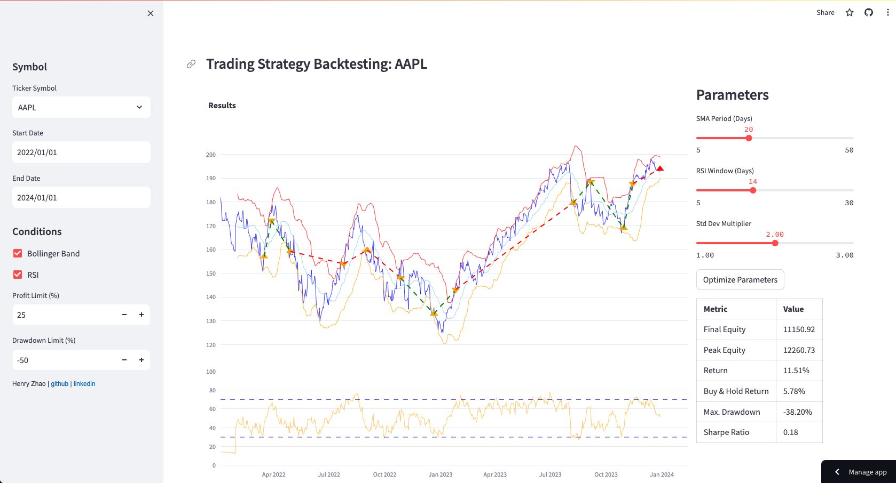

# Strategy Backtesting Webapp

This WebApp is deployed and available at: [https://backtest-web.streamlit.app/](https://backtest-web.streamlit.app/)

## Overview
The Strategy Backtesting Webapp is a tool designed to backtest trading strategies using the Relative Strength Index (RSI) and Bollinger Bands indicators. The web application is built using Python and provides a streamlined interface through StreamLit for analyzing historical market data of 7 equities, and evaluating the performance of different trading strategies.



## Indicator Calculations
The `process.py` module is responsible for calculating the RSI and Bollinger Bands indicators. These are calculated without the use of external libraries. The RSI is calculated using the average gain and average loss over a specified period of time, while the Bollinger Bands are calculated using the standard deviation of the closing prices and a specified number of standard deviations.

## How to Use It
The purpose of the Strategy Backtesting Webapp is to allow users to test and evaluate different trading strategies using historical market data. Users can upload their own data or use preloaded datasets, specify the parameters for the RSI and Bollinger Bands indicators, and analyze the performance of their strategies.

To use the app, follow these steps:
1. Select a Symbol and a Date Range
2. Determine Entry/Exit conditions - which indicator(s) to use, and to limit profit or drawdown amounts
3. Adjust the parameters of the strategy
4. Backtesting is run and updated automatically as parameters are adjusted
5. Press the Optimize Parameters to find the parameters that result in the highest Sharpe ratio

## Parameters
The Strategy Backtesting Webapp allows users to customize the parameters for the RSI and Bollinger Bands indicators. Here are the main parameters and their effects:

- RSI Period: Specifies the number of days in the period used to calculate the RSI. A shorter period may result in more frequent trading signals, while a longer period may provide more reliable signals but with fewer opportunities.
- Bollinger Bands Period: Determines the number of days in the period used to calculate the Bollinger Bands. A shorter period may result in noisier bands and more frequent trading signals, while a longer period may result in smoother bands and fewer signals.
- Bollinger Bands Standard Deviation: Specifies the number of standard deviations used to calculate the upper and lower bands. A higher standard deviation will result in wider bands and fewer trading signals, while a lower standard deviation will result in narrower bands and more signals.

### Calculation of RSI
```python
def rsi(array, window):
    deltas = np.diff(array)
    seed = deltas[:window+1]
    up = seed[seed >= 0].sum()/window
    down = -seed[seed < 0].sum()/window
    rs = up/down
    rsi = np.zeros_like(array)
    rsi[:window] = 100. - 100./(1. + rs)

    for i in range(window, len(array)):
        delta = deltas[i - 1]

        if delta > 0:
            upval = delta
            downval = 0.
        else:
            upval = 0.
            downval = -delta

        up = (up*(window - 1) + upval)/window
        down = (down*(window - 1) + downval)/window

        rs = up/down
        rsi[i] = 100. - 100./(1. + rs)

    return rsi
```

### Calculation of Bollinger Bands
```python
# Using Pandas dataframes
stock_data['SMA'] = stock_data['Close'].rolling(window=sma_period).mean()
stock_data['STD'] = stock_data['Close'].rolling(window=sma_period).std()
stock_data['Upper_Band'] = stock_data['SMA'] + (stock_data['STD'] * std_dev_multiplier)
stock_data['Lower_Band'] = stock_data['SMA'] - (stock_data['STD'] * std_dev_multiplier)
```